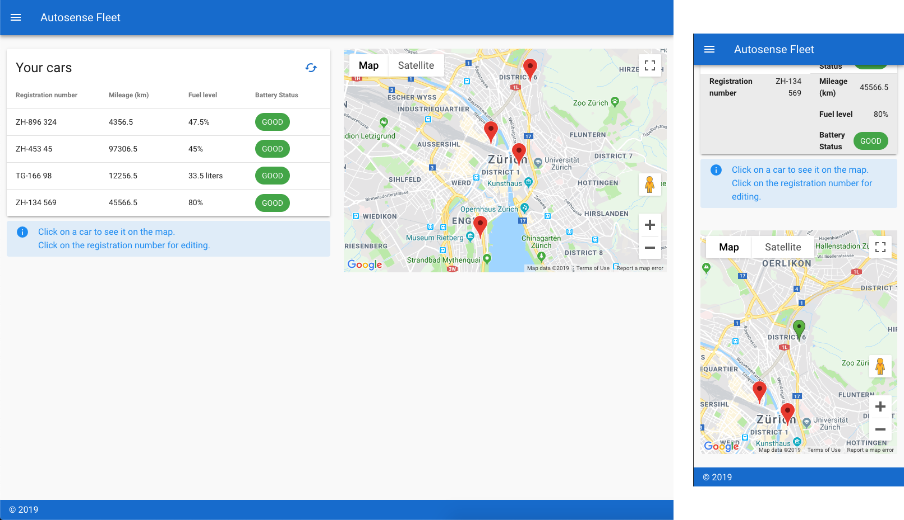

# Vue.js Frontend for Autosense Test Exercise

[](https://circleci.com/gh/edipetres/autosense-frontend)

[Demo website](http://autosense-frontend.s3-website.eu-central-1.amazonaws.com/) hosted on AWS S3 as a static website.

## Architecture

The project implements one view in the component called `Home.vue`. This is responsible for loading the data upon app startup and stores it in the store - for having a single source of truth. The view of the `Home` component is wrapped inside the main entry file `App.vue` which displays the navigation, footer and sidebars. This allows the code inside the view to be focused on their own role and not have to manage menus and navigational panels.

There are two components inside Home: `FleetMap.vue` and `FleetTable.vue`. `FleetMap` implements Google maps and loads the vehicle's position data from the store. It can also talk to the parent component to trigger a refresh of the data. `FleetTable` processes the data from the store lists all the cars. It enables editing of the car's registration which triggers a `PUT` request to be sent to the server.

There is an example side navigation drawer that automatically adjusts for each device size.

## Responsive layout

Thanks to Vuetify's grid system the app implements a responsive layout. In our case content will nicely resizes automatically for mobile, table, desktop and large monitors.



## Progressive Web App

While the app can be used in mobile browsers, it can also be upgraded to a PWA which allows the app to be 'installed' on the home screen and work even when it's offline. When the app is installed it will look and feel like a native application. However, our Progressive Web App capabilities are limited (like service worker) due to not currently running on HTTPS.

## Continuous Integration and Delivery

Similarly to our backend CI pipeline, this project also implements a CircleCI build server that installs all dependencies on a clean machine and builds then pushes the production files to Amazon S3. Testing should be included here in the pipeline before the deployment step. When a satisfying code coverage is achieved we can trust the build server to deploy each version staright to production.

## Tools

- **Vue.js 2.6** - JavaScript framework
- **Vuex** - state management
- **Vuetify 2.0** - component framework based on Material Design
- **Axios** - promise based HTTP requests
- **SASS**
- **Mocha and Chai** - unit testing
- **Cypress** - end to end testing

## Contributing
```
npm install
```

### Compiles and hot-reloads for development
```
npm run serve
```

### Compiles and minifies for production
```
npm run build
```

### Run your end-to-end tests
```
npm run test:e2e
```

### Run your unit tests
```
npm run test:unit
```
